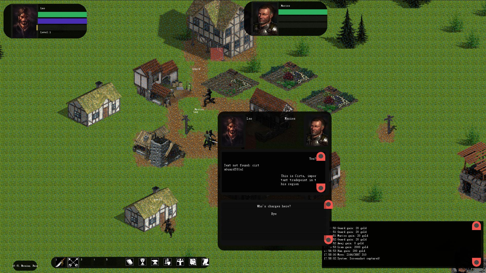
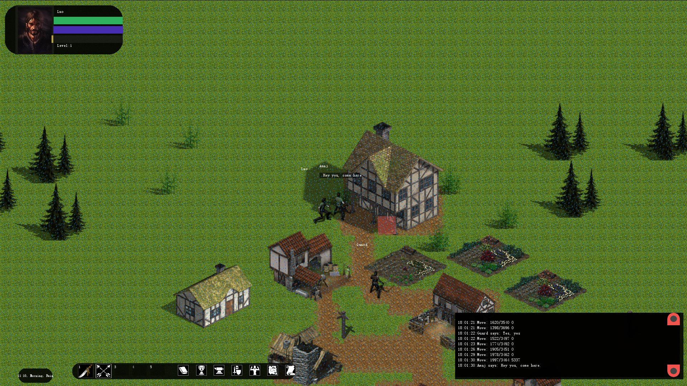
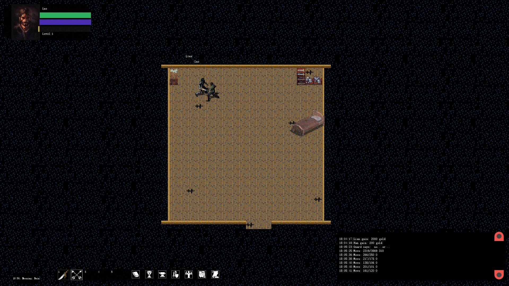

# Senlin
Senlin is a completely free and open-source 2D cRPG game. The game works on its own engine written from scratch in Java with Slick2D library.
 
The game engine is completely modular, it means you can easily create your own modules with maps, NPCs, items, quests, and dialogues without any source code modification.
The engine does not use any binary files, so all data files like item bases, scenarios, saved games, are easy to read and modify, most of them are in XML format.
 
Currently available in the alpha version.

For more information/help check [game documentation](http://senlin.isangeles.pl/guide/).

## Installation
Simply download and unpack [build](https://github.com/Isangeles/Senlin/releases).

## Run
Simply run senlin executable(.sh on Linux or .exe on Windows).

If you have problem with game startup, try to change game resolution(in game.conf) to your current resolution or one of these: 1920x1080, 1600x800, 1280x720.

## Build
You can use OpenJDK 14, earlier versions should also work.

The easiest way to build a project is to use [Gradle](https://gradle.org/).

You can download Gradle yourself and use gradle command or run gradlew/gradlew.bat script to do this automatically.

Navigate to main directory and run gradlew/gradlew.bat script:
```
  ./gradlew run
```
or to get executable files:
```
  ./gradlew build
```
The executable jar will be placed in build/libs.

## Screenshots




## Contact
* Isangeles <<dev@isangeles.pl>>

## License
Copyright 2017-2020 Dariusz Sikora <<dev@isangeles.pl>>

This program is free software; you can redistribute it and/or modify it under the terms of the GNU General Public License as published by the Free Software Foundation; either version 2 of the License, or (at your option) any later version.

This program is distributed in the hope that it will be useful, but WITHOUT ANY WARRANTY; without even the implied warranty of MERCHANTABILITY or FITNESS FOR A PARTICULAR PURPOSE. See the GNU General Public License for more details.

You should have received a copy of the GNU General Public License along with this program; if not, write to the Free Software Foundation, Inc., 51 Franklin Street, Fifth Floor, Boston, MA 02110-1301, USA.
